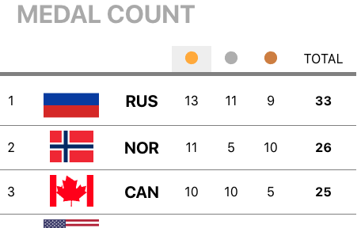

# Top 10 Olympic Medals
Lets you sort top performing countries at the Olympics

## Setup
Quickly:
* `npm i`
* `npm run start`

See details at [Create React App](https://github.com/facebook/create-react-app).

## Notes
This is a working demo to show the clean, performant & responsive code
that is possible with SVG and ReactJS v16 on modern browsers.
All (unused) Create-React-App 2.0 libraries are kept, for simple upgrades.

Medals demonstrates best practices in
* Maintainable code: functional programming, clean jsdoc, CI
* Performance
* Security
* User eXperience is reasonable
* Design is reasonable, perhaps limited by open licensing

With your feedback, this project can be an educational tool!

## Scripts

### `npm start`
Runs development mode with hot reload of edits. 
Open [http://localhost:3000](http://localhost:3000) to view it in the browser.

### `npm test`
Launches the test runner in the interactive watch mode. 

### `npm run build`
Builds the app for production to the `build` folder. 

### `npm run eject`
**Note: this is a one-way operation. Once you `eject`, you can’t go back!** 
Not recommended: forces you to maintain custom upgrades of _all_ dependent libraries

## Supported Browsers
By default, the generated project supports all modern (evergreen) browsers. 
Support for Internet Explorer is unlikely.

## Credits
Flag clipart from http://www.wikipedia.org
See also alternative flags at https://www.phoca.cz/cssflags/

## To Do
Optimize *.svg in webpack with svgo
